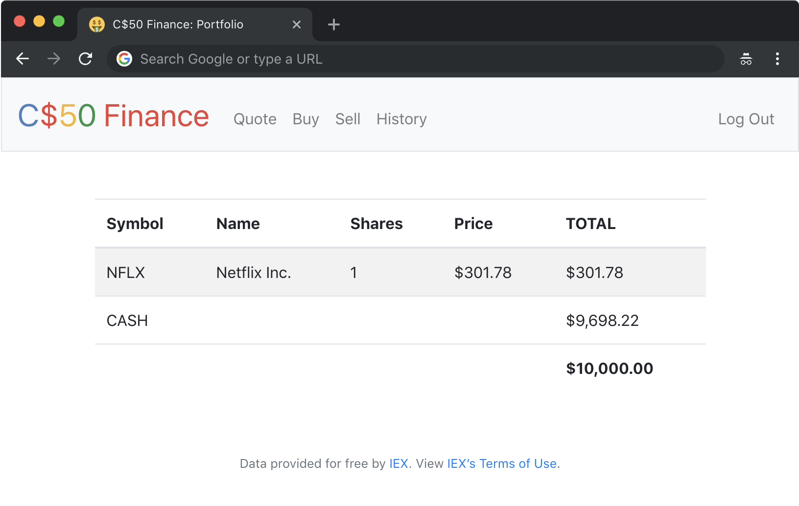

# C$50 Finance

### This is the Finance project of Harvard CS50 course.

For this Harvard CS50 course project, I built a web application allowing users to open accounts, login/logoff, quote real time stock price from IEX Cloud via API, buy/sell stocks, record transactions and balances in SQLite database.
